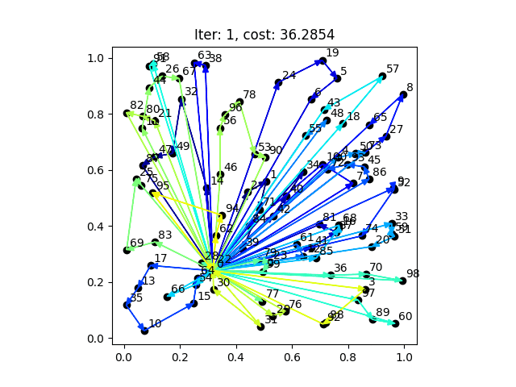

# NeuroLS
This is the repository to the corresponding paper
"Learning to Control Local Search for Combinatorial Optimization"

- ECML-PKDD 2022: [https://2022.ecmlpkdd.org/wp-content/uploads/2022/09/sub_689.pdf](https://2022.ecmlpkdd.org/wp-content/uploads/2022/09/sub_689.pdf)
- arXiv (with appendix): [https://arxiv.org/abs/2206.13181](https://arxiv.org/abs/2206.13181)


We implement a Neural Local Search solver combining a GNN-based
learned meta-controller (meta-heuristic) with local search for 
routing problems (via VRPH) and 
job shop scheduling problems (custom solver implementation)

In this repo we provide our GNN models and the final checkpoints
used in the experiments. Furthermore, the open source code of our 
[custom JSSP solver](lib/scheduling) 
and the 
[extensions and python bindings](lib/routing/local_search) 
for the VRPH C++ solver.

---
### Setup
Install the requirements as conda environment
```sh
conda env create -f requirements.yml
```


---
### run benchmarks
To run NeuroLS on JSSP Taillard benchmark instances of size 15x15 for 100 steps
```
python run_benchmark.py -r run_nls_jssp.py -d data/JSSP/benchmark/TA/ -g 15x15 -p jssp -m nls -e eval_jssp --args "env=jssp15x15_unf" -n 100
```
To run PDR "FIFO" on JSSP Taillard benchmark instances of size 15x15
```
python run_benchmark.py -r run_pdr.py -d data/JSSP/benchmark/TA/ -g 15x15 -p jssp -m pdr --args "env=jssp15x15_unf" --policy fifo
```
To run MetaHeuristic "SA" on JSSP Taillard benchmark instances of size 15x15 for 100 steps
```
python run_benchmark.py -r run_meta_jssp.py -d data/JSSP/benchmark/TA/ -g 15x15 -p jssp -m meta --args "env=jssp15x15_unf" --policy sa -n 100
```

To run NeuroLS on CVRP Uchoa benchmark instances group n100 for 200 steps
```
python run_benchmark.py -r run_nls_rp.py -d data/CVRP/benchmark/uchoa/ -g n100 -p cvrp -m nls -e eval_cvrp --args "env=cvrp100_unf" -n 200
```

---
### Please cite us:

```
@inproceedings{falkner2022learning,
  title={Learning to Control Local Search for Combinatorial Optimization},
  author={Falkner, {Jonas K.} and Thyssens, Daniela and Bdeir, Ahmad and Schmidt-Thieme, Lars},
  booktitle={Proceedings of the European Conference on Machine Learning and Principles and Practice of Knowledge Discovery in Databases (ECML PKDD)},
  year={2022}
}
```


---
example rendered episodes on JSSP15x15 and CVRP100



